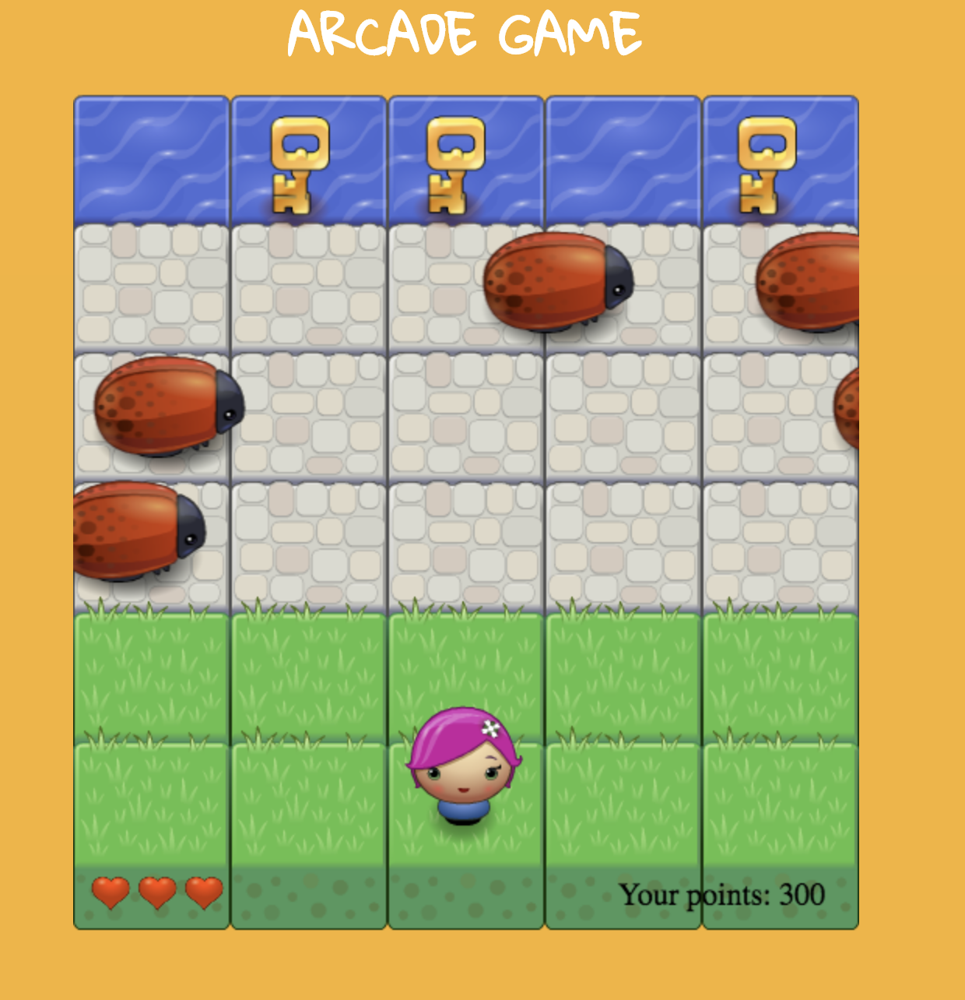

frontend-nanodegree-arcade-game
===============================

## What is this? 
This is an arcade game which is one of my FEND projects

## To play
Load this in your browser https://sandraisrael.github.io/fend-arcade-game/

## Instructions
* Use your arrow keys to move the player: up, down, left, right. 
* Ensure your player doesn't collide with the bugs. You loose a life and 50pts on any collison.

## How I built this
This game was built majorly using JavaScript object-oriented programming features. Check the code.